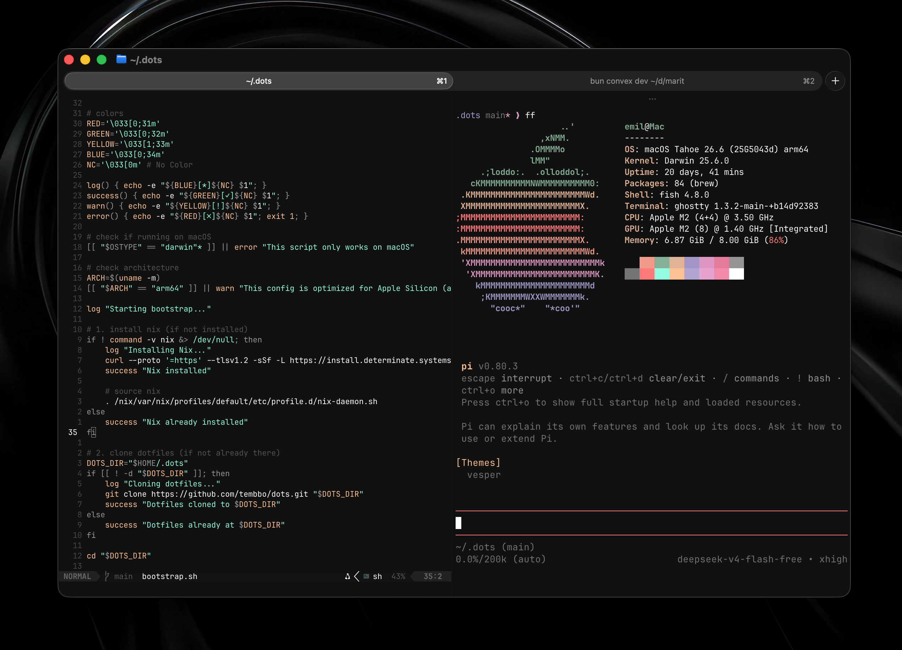

# dotfiles



These are my personal dotfiles. I've tried to keep things fairly straightforward, but if you wish to copy from this, you'll likely need to tweak some things to fit your own machine.

## Setup

The bootstrap script installs brew and stow (if not already installed), clones/updates the repository and creates symlinks for the configuration files in `~/.config`. It does not install the programs configured by these dotfiles.

```sh
curl -fsSL https://raw.githubusercontent.com/tembbo/dots/main/bootstrap.sh | bash
```

You can also run the script locally after cloning:

```sh
bash bootstrap.sh
```
